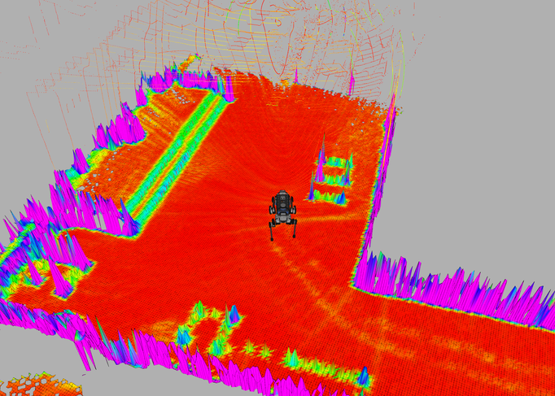

# Elevation Mapping cupy
[](https://ci.leggedrobotics.com/job/<repo_host>_leggedrobotics/job/elevation_mapping_cupy/job/master/)

## Overview
This is a ros package of elevation mapping on GPU.  
Code are written in python and uses cupy for GPU calculation.  


## Installation

### CUDA & cuDNN
The tested versions are CUDA10.2.89, cuDNN8.0.0.180

#### CUDA
You can download CUDA10.2 from [here](https://developer.download.nvidia.com/compute/cuda/repos/ubuntu1804/x86_64/cuda-ubuntu1804.pin).  
You can follow the instruction.
```bash
wget https://developer.download.nvidia.com/compute/cuda/repos/ubuntu1804/x86_64/cuda-ubuntu1804.pin
sudo mv cuda-ubuntu1804.pin /etc/apt/preferences.d/cuda-repository-pin-600
sudo apt-key adv --fetch-keys https://developer.download.nvidia.com/compute/cuda/repos/ubuntu1804/x86_64/7fa2af80.pub
sudo add-apt-repository "deb https://developer.download.nvidia.com/compute/cuda/repos/ubuntu1804/x86_64/ /"
sudo apt-get update
sudo apt-get -y install cuda
```

#### cuDNN
You can download specific version from [here](https://developer.download.nvidia.com/compute/machine-learning/repos/ubuntu1804/x86_64/).  
For example, the tested version is with `libcudnn8_8.0.0.180-1+cuda10.2_amd64.deb`.

Then install them using the command below.
```bash
sudo dpkg -i libcudnn8_8.0.0.180-1+cuda10.2_amd64.deb
sudo dpkg -i libcudnn8-dev_8.0.0.180-1+cuda10.2_amd64.deb
```

#### Other information
[CUDA](https://docs.nvidia.com/cuda/cuda-installation-guide-linux/index.html#ubuntu-installation)  
[cuDNN](https://docs.nvidia.com/deeplearning/sdk/cudnn-install/index.html#install-linux).


#### On Jetson
`CUDA` and `cuDNN` can be installed via apt. It comes with nvidia-jetpack. The tested version is jetpack 4.5 with L4T 32.5.0.

NVIDIA does not provide a image for Ubuntu 20.04. The tested version therefore still uses ROS Melodic.

### Python dependencies
- [numpy==1.19.5](https://www.numpy.org/)
- [scipy==1.5.4](https://www.scipy.org/)
- [cupy==9.1.0](https://cupy.chainer.org/)
- [shapely==1.7.1](https://github.com/Toblerity/Shapely)
- [torch==1.8.0](https://pytorch.org/)

Pytorch
```bash
wget https://nvidia.box.com/shared/static/p57jwntv436lfrd78inwl7iml6p13fzh.whl -O torch-1.8.0-cp36-cp36m-linux_aarch64.whl
pip3 install Cython
pip3 install numpy==1.19.5 torch-1.8.0-cp36-cp36m-linux_aarch64.whl
```

Others
```bash
pip3 install scipy==1.5.4 cupy==9.1.0 shapely==1.7.1
```
On jetson, pip3 builds the packages from source so it would take time.

Also, on jetson you need fortran (should already be installed).
```bash
sudo apt install gfortran
```

cupy can be installed with specific CUDA versions. (On jetson, only "from source" i.e. via pip3 could work)
> (For CUDA 9.0)
> % pip install cupy-cuda90
>
> (For CUDA 9.1)
> % pip install cupy-cuda91
>
> (For CUDA 9.2)
> % pip install cupy-cuda92
>
> (For CUDA 10.0)
> % pip install cupy-cuda100
>
> (Install CuPy from source)
> % pip install cupy

### ROS package dependencies

- [pybind11_catkin](https://github.com/ipab-slmc/pybind11_catkin)
- [grid_map_msgs](https://github.com/ANYbotics/grid_map)

```bash
sudo apt install ros-noetic-pybind11-catkin
sudo apt install ros-noetic-grid-map-msgs
```

#### On Jetson

- [pybind11_catkin](https://github.com/ipab-slmc/pybind11_catkin)
- [grid_map_msgs](https://github.com/ANYbotics/grid_map)

```bash
sudo apt install ros-melodic-pybind11-catkin
```

For interaction with ROS Noetic the recomended way is to compile grid map from source via the open source package or ANYmal Research.

## Usage
### Build
```bash
catkin build elevation_mapping_cupy
```

### Run
```bash
roslaunch elevation_mapping_cupy elevation_mapping_cupy.launch
```
### Subscribed Topics

* topics specified in **`pointcloud_topics`** in **`parameters.yaml`** ([sensor_msgs/PointCloud2])

    The distance measurements.

* **`/tf`** ([tf/tfMessage])

    The transformation tree.


### Published Topics

* **`elevation_map_raw`** ([grid_map_msg/GridMap])

    The entire elevation map.


* **`elevation_map_recordable`** ([grid_map_msg/GridMap])

    The entire elevation map with slower update rate for visualization and logging.
